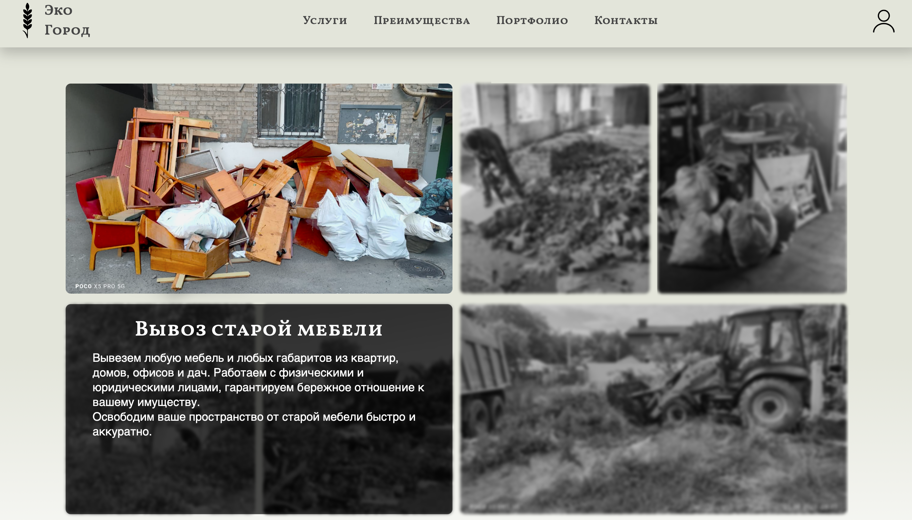
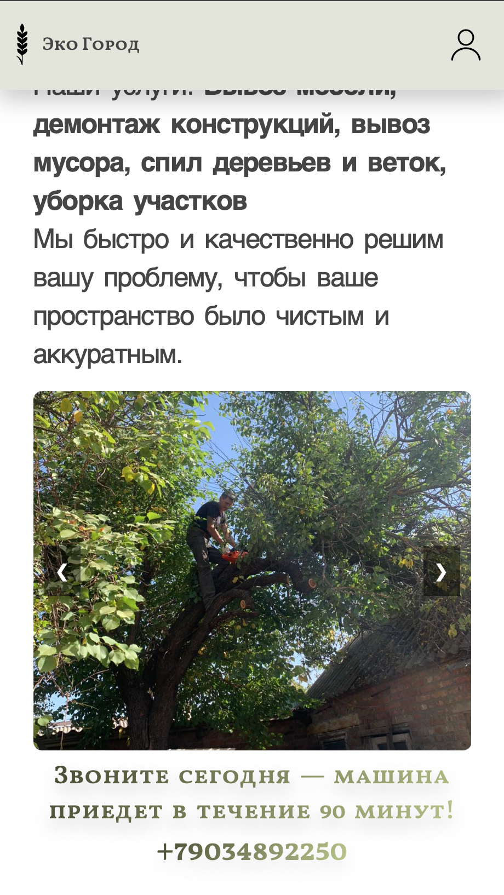

# 🚛 вывозмусора61.рф — Лендинг компании «EcoCity»

Коммерческий одностраничный сайт для компании, предоставляющей услуги вывоза мусора, демонтажа и уборки участков. Проект реализован на нативном стеке Html с применением сложных CSS-взаимодействий и прямой интеграцией лид-форм с Telegram API.

🌐 **Cайт:** [вывозмусора61.рф](https://вывозмусора61.рф)

---

## 📸 Превью

| Desctop | Mobile |
|:---:|:---:|
|  |  |

---

## 📋 Структура и функционал

### 1. Главный экран «О компании»
Презентационный блок с описанием профиля компании. Содержит слайдер с фотографиями процесса работы и фокусный призыв к действию (CTA): вызов машины в течение 90 минут с прямым номером телефона.

### 2. Интерактивный блок «Услуги»
Сетка (Grid) с фотографиями предоставляемых услуг. Реализована сложная визуальная логика взаимодействия при наведении курсора (`hover`):
- Выбранная карточка увеличивается в масштабе (3D-эффект выделения).
- Из-под элемента плавно выезжает панель с подробным текстовым описанием услуги.
- **Фокус-эффект:** все остальные карточки в сетке динамически обесцвечиваются (переходят в чёрно-белый фильтр), акцентируя внимание пользователя исключительно на выбранной услуге.

### 3. Блок «Почему мы?»
Структурированная подача преимуществ компании:
- **Профессионализм:** выезд специалиста и точная оценка.
- **Ответственность:** сохранность имущества и техника безопасности.
- **Современное оборудование:** высокая скорость работы.
- **Выгодные цены:** работа с физ. и юр. лицами, предоставление полного пакета документов.

### 4. Портфолио
Вертикальная лента (колонка) с реальными фотографиями с объектов, подтверждающая заявленный опыт.

### 5. Форма обратной связи
Блок захвата лидов (заявка на выезд/консультацию). 
- Форма содержит базовую валидацию на стороне клиента.
- **Интеграция:** При сабмите данные собираются с помощью JavaScript и через `fetch` запрос (Telegram Bot API) моментально отправляются в рабочий Telegram-чат диспетчера/владельца бизнеса.

### 6. Футер
Контактная информация: адрес, email, телефон и ссылки на социальные сети.

---

## 🛠 Стек технологий

| Категория | Технологии |
|---|---|
| **Frontend** | HTML5,  JavaScript (ES6+) |
| **Стилизация** | Нативный CSS3 |
| **Анимации** | CSS Transitions|
| **Интеграции** | Telegram Bot API (отправка форм без backend-сервера) |
| **UI/UX Дизайн** | Разработан самостоятельно |

---

## ⚙️ Технические особенности

**Native Stack (Без фреймворков).** Проект намеренно написан без использования тяжелых JS-библиотек или фреймворков. Это обеспечивает максимальную скорость загрузки сайта и идеальные показатели в Google Lighthouse, что критично для SEO лендинга.

**Сложные CSS-селекторы.** В блоке «Услуги» эффект фокусировки (соседние элементы становятся ч/б) реализован с помощью комбинации возможностей CSS и JS-обработчиков событий, чтобы применять классы-состояния к родительскому контейнеру.

**Direct API Integration.** Отправка заявок реализована напрямую с клиента в мессенджер через Telegram API. Это позволило избежать необходимости поднимать, оплачивать и поддерживать отдельный Backend-сервер, решив задачу бизнеса минимальными ресурсами.

**Адаптивность.** Сайт полностью отзывчив. Адаптив построен на классическом подходе с использованием `@media (max-width)` брейкпоинтов, что обеспечивает корректное отображение на любых мобильных устройствах.

---

## 👥 Команда


| Роль | Имя | Работа |
|---|---|---|
| **UI/UX & Разработка** | [Рустам](https://github.com/Rusta-16) | Проектирование интерфейса, HTML/CSS вёрстка, написание скриптов, интеграция с Telegram, дизайн |

---

## 🚀 Запуск проекта локально

**1. Клонировать репозиторий:**
```
git clone https://github.com/Rusta-16/EcoCity.git
```
**2. Перейти в директорию:**
```
cd EcoCity
```
**3. Открыть проект:**
